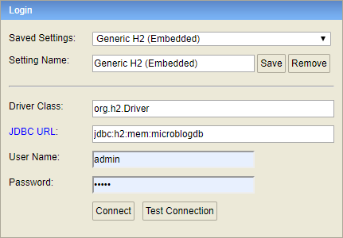

# Api-MicroBlog_Spring-Boot
 -Una volta avviato il progetto incollare questo link sul browser per accedere all'interfaccia GUI del database h2:  
 http://localhost:8080/h2/  
   
 -Utilizzare questa configurazione:  
   
 -Username: admin  
 -Password: admin
 
